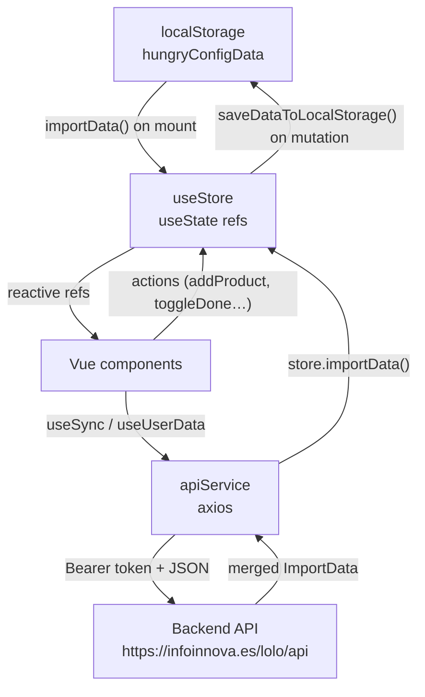

nHungry is a Nuxt 3 progressive web app (PWA) built with Vue 3 and TypeScript. Server-side rendering is disabled (`ssr: false`) and Nuxt's pages routing is disabled (`pages: false`), so the entire UI lives in a single `app.vue` root component. Navigation between sections is handled by a reactive `currentPage` ref rather than the Vue Router. Bootstrap 5 provides the visual layer, and `@vite-pwa/nuxt` registers a service worker in production builds so the app works offline.

## Tech stack

| Layer | Technology |
|---|---|
| Framework | Nuxt 3, Vue 3, TypeScript |
| Styles | Bootstrap 5 |
| State | `useStore()` via Nuxt `useState()` |
| Persistence | `localStorageService` (key: `hungryConfigData`) |
| HTTP | axios with request/response interceptors |
| PWA | `@vite-pwa/nuxt` + Workbox |
| Auth | JWT Bearer token + device fingerprint |
| Modals | SweetAlert2 |
| Drag-and-drop | vuedraggable |
| Notifications | `@kyvg/vue3-notification` |

## Directory structure

```text
nHungry/
├── app.vue                  # Root component — tab shell
├── nuxt.config.ts           # ssr: false, pages: false, PWA config
├── localStorageService.ts   # localStorage wrapper (key: hungryConfigData)
├── types/
│   └── index.ts             # Shared TypeScript interfaces
├── composables/
│   ├── useStore.ts          # Global state (useState refs)
│   ├── useAuth.ts           # Login / register / logout
│   ├── useSync.ts           # Cloud sync logic
│   ├── useFingerprint.ts    # Device fingerprinting
│   ├── useProductFilter.ts  # Search / filter for product lists
│   ├── useDraggable.ts      # Drag-and-drop ordering
│   ├── useMyInputModal.ts   # Text input modal
│   ├── useMyProductEditModal.ts # Product edit modal
│   ├── useFormChanges.ts    # Dirty-field tracking for forms
│   ├── useLetterIndicator.ts # A–Z scroll indicator
│   └── useUserData.ts       # Fetch and compare server data
├── services/
│   └── apiService.ts        # Axios-based API client (singleton)
├── components/              # My-prefixed Vue components
├── pages/                   # Tab page components (not Nuxt pages)
│   ├── add.vue              # Add products tab
│   ├── a2z.vue              # Alphabetical list tab
│   ├── categorias.vue       # Category list tab
│   ├── cart.vue             # Shopping cart tab
│   └── config.vue           # Configuration tab
├── utils/                   # Pure utility functions
└── css/                     # Global stylesheets
```

## Key architectural decisions

<CardGroup cols={2}>
  <Card title="SSR and routing disabled" icon="ban">
    `ssr: false` and `pages: false` are set in `nuxt.config.ts`. The app runs entirely in the browser with no server rendering and no file-based routing.
  </Card>
  <Card title="Single root with async tabs" icon="layer-group">
    `app.vue` renders all tabs via `defineAsyncComponent`, loading each page component only when first needed. Switching tabs shows or hides `<div>` panels without unmounting components.
  </Card>
  <Card title="Custom state — no Pinia" icon="database">
    Global state is held in `useStore()` using Nuxt's built-in `useState()`, which provides SSR-safe reactive refs. This avoids a Pinia dependency while still giving shared, reactive state across all components.
  </Card>
  <Card title="localStorage as the source of truth" icon="floppy-disk">
    `localStorageService` persists the full app state under one key (`hungryConfigData`). On mount, `app.vue` reads this key and calls `store.importData()`. Every state mutation calls `saveDataToLocalStorage()`.
  </Card>
  <Card title="My prefix convention" icon="tag">
    All custom Vue components are prefixed with `My` (e.g. `MyButton`, `MyInput`, `MyProduct`). Components are registered globally via `nuxt.config.ts` so no import is needed inside templates.
  </Card>
  <Card title="PWA in production only" icon="wifi-slash">
    The `@vite-pwa/nuxt` module is only registered in production builds. In development (`NODE_ENV !== 'production'`), it is a no-op, so the service worker does not interfere with hot-reload.
  </Card>
</CardGroup>

## Data flow

The diagram below shows how data moves through the application at runtime.



### Startup sequence

<Steps>
  <Step title="Mount app.vue">
    The `onMounted` hook fires. `localStorageService.getItem()` reads `hungryConfigData` from the browser's localStorage.
  </Step>
  <Step title="Hydrate the store">
    If data exists, `store.importData(data)` populates all reactive refs. If not, `store.exportData()` writes the default state back to localStorage.
  </Step>
  <Step title="Reveal the UI">
    After a 50 ms delay (to ensure reactivity has settled), `dataLoaded` is set to `true` and the tab shell renders.
  </Step>
  <Step title="Async tab components load">
    Clicking a tab for the first time triggers `defineAsyncComponent` to fetch and mount that tab's `.vue` file.
  </Step>
</Steps>

## Tab navigation

There are five tabs defined as static data inside `useStore()`:

| ID | Page key | Description |
|---|---|---|
| 0 | `config` | App configuration and account |
| 1 | `add` | Add new products |
| 2 | `a2z` | Products sorted A–Z |
| 3 | `categorias` | Products grouped by category |
| 4 | `cart` | Shopping cart (purchased items) |

`app.vue` iterates the `tabs` array to render the nav bar and builds a `componentsMap` record with one `defineAsyncComponent` entry per tab. The active tab is tracked by a `currentPage` ref. Components stay mounted in the DOM after first load — only their containing `<div>` is toggled between `display: block` and `display: none`.

## PWA and offline support

In production, Workbox pre-caches all JS, CSS, HTML, PNG, SVG, and ICO assets. Remote images from `ik.imagekit.io` are cached with a `NetworkFirst` strategy (up to 10 entries, 24-hour expiry). When a network request fails, `apiService` queues it in localStorage under `pendingRequests` and replays the queue automatically once connectivity is restored.

## Related pages

<CardGroup cols={2}>
  <Card title="Composables reference" icon="puzzle-piece" href="/development/composables">
    Detailed API for every composable in the project.
  </Card>
  <Card title="useStore: global state" icon="database" href="/development/store">
    Full reference for the reactive state, computed values, and actions in `useStore()`.
  </Card>
  <Card title="REST API endpoints" icon="server" href="/development/api-service">
    Backend endpoint documentation and error-handling behaviour.
  </Card>
  <Card title="Cloud sync" icon="arrows-rotate" href="/account/cloud-sync">
    How data synchronisation works from the user's perspective.
  </Card>
</CardGroup>
